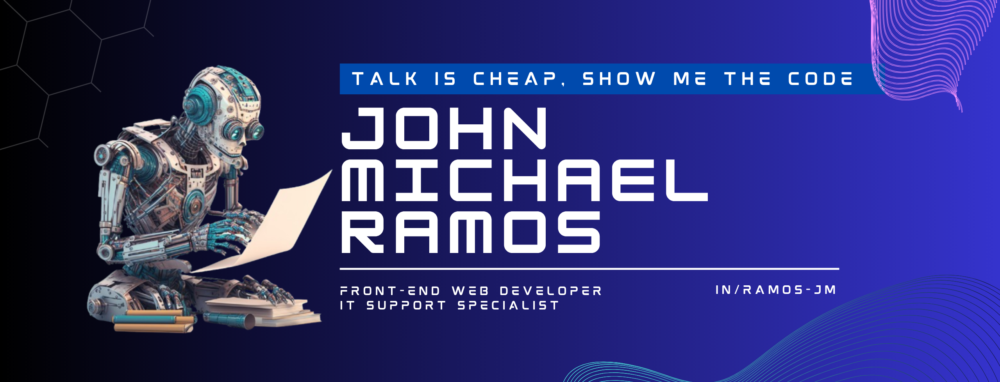

  
  

  
  
  
  
  
  

  
  
  |  |  |  |
  | ------------------------------------------------------------------------------------------------------------------------ | -------------------------------------------------------------------------------------------------------------------------- | ------------------------------------------------------------------------------------------------------------------------- |
  
  
  
   
  
  
  
  
  
  
   
  
  
  
  
  
  
  
  
  
  
  
  
  
  
   
  
    
    
    
    
    
    
    
    
    
    
    
    
    
  
  
  

  
  | Program/Course | School | School Year |
  | :-------------: | :-----: | :-----------: |
  | Bachelor of Science Computer Science | New Era University | 2021 - 2025 |
  | Information Communication Technology - ICT  (SHS) | Informatics College Cavite | 2019 - 2021 |
  
  

  
  

  
  | Certificate | Issued by | Date Issued |
  | :------------- | :-----: | :-----------: |
  | <a href="https://www.skillfront.com/Badges/94594486533691">Certified Associate In Scrum Fundamentals™ (CASF™)</a> | SkillFront | January 2025 |
  | <a href="https://www.skillfront.com/Badges/08994506637121">SkillFront Entrepreneur Program™: Foundations Of Business And Entrepreneurship™</a> | SkillFront | January 2025 |
  | <a href="https://www.skillfront.com/Badges/66003678154945">ISO/IEC 27001 Information Security Associate™</a> | SkillFront | January 2025 |
  | <a href="https://www.credly.com/badges/44db0f5e-47cb-4a4f-8017-1fe78f25156e/linked_in_profile">Introduction to Cybersecurity</a> | Cisco | December 2024 |
  | <a href="https://www.cloudskillsboost.google/public_profiles/998cc779-20c9-4169-9de8-78d6ef367339/badges/13136766?utm_medium=social&utm_source=linkedin&utm_campaign=ql-social-share">Introduction to Generative AI</a> | Google Cloud | December 2024 |
  | <a href="https://www.cloudskillsboost.google/public_profiles/998cc779-20c9-4169-9de8-78d6ef367339/badges/13136830?utm_medium=social&utm_source=linkedin&utm_campaign=ql-social-share">Introduction to Large Language Models</a> | Google Cloud | December 2024 |
  | <a href="https://www.cloudskillsboost.google/public_profiles/998cc779-20c9-4169-9de8-78d6ef367339/badges/13136862?utm_medium=social&utm_source=linkedin&utm_campaign=ql-social-share">Introduction to Responsible AI</a> | Google Cloud | December 2024 |
  | <a href="https://www.freecodecamp.org/certification/JohnMichaelRamos/machine-learning-with-python-v7">Machine Learning with Python</a> | freeCodeCamp | December 2024 |
  | <a href="https://www.credly.com/badges/afcdab5b-cce7-484a-a1e7-543a9f51120a/linked_in_profile">Prompt Design in Vertex AI</a> | Google Cloud | December 2024 |
  | <a href="https://www.cloudskillsboost.google/public_profiles/998cc779-20c9-4169-9de8-78d6ef367339/badges/13136892?utm_medium=social&utm_source=linkedin&utm_campaign=ql-social-share">Responsible AI:Applying AI Principles with Google Cloud</a> | Google Cloud | December 2024 |
  | <a href="https://www.credly.com/badges/c974486e-c681-4f60-a057-2792a0a94718/linked_in_profile">Scrum Foundation Learner 2025</a> | CertiProf | December 2024 |
  | <a href="https://courses.cognitiveclass.ai/certificates/b846777953f84ae38e8d6905fb51f7af">The Art of Prompt Engineering</a> | CognitiveClass | December 2024 |
  | <a href="https://www.credly.com/badges/c95b2e72-b89c-4f8b-a5a9-6fb76e75cacd/linked_in_profile">Artificial Intelligence Fundamentals</a> | Cisco | June 2024 |
  | <a href="https://www.kaggle.com/learn/certification/johnmichaelcramos/intro-to-programming">Intro to Programming</a> | Kaggle | November 2023 |
  | <a href="https://www.credly.com/badges/4f6b5a21-71b6-4c6b-a90d-3c4a1bb2f12d/public_url">Data Analytics Essentials</a> | Cisco | October 2023 |
  | <a href="https://www.credly.com/badges/160392a2-82fb-413d-9815-20ca7cf229a4/public_url">Introduction to Data Science</a> | Cisco | October 2023 |
  | <a href="https://www.simplilearn.com/skillup-certificate-landing?token=eyJjb3Vyc2VfaWQiOiI2NjQiLCJjZXJ0aWZpY2F0ZV91cmwiOiJodHRwczpcL1wvY2VydGlmaWNhdGVzLnNpbXBsaWNkbi5uZXRcL3NoYXJlXC90aHVtYl80NDk4Nzk2XzE2OTQwODQyODAucG5nIiwidXNlcm5hbWUiOiJKb2huIE1pY2hhZWwgQy4gUmFtb3MifQ%3D%3D&utm_source=shared-certificate&utm_medium=lms&utm_campaign=shared-certificate-promotion&referrer=https%3A%2F%2Flms.simplilearn.com%2Fcourses%2F2738%2FBusiness-Analytics-with-Excel%2Fcertificate%2Fdownload-skillup&%24web_only=true">Business Analytics with Excel</a> | Simplilearn | September 2023 |
  | <a href="https://www.coursera.org/account/accomplishments/professional-cert/ZXDWS35PQK5B">Google Data Analytics</a> | Coursera | September 2023 |
  | <a href="https://www.coursera.org/account/accomplishments/professional-cert/ZD5ES2AAEPU9?utm_source=link&utm_medium=certificate&utm_content=cert_image&utm_campaign=sharing_cta&utm_product=prof">Google IT Support</a> | Coursera | July 2023 |
  | <a href="https://catalog-education.oracle.com/ords/certview/sharebadge?id=AC1CD7BC2ED20729F7D84529E2B0BAC70DB621ACDFF462E865762514F5413C61">Oracle Cloud Data Management 2022 Foundations Certified Associate</a> | Oracle | December 2022 |
  | <a href="https://catalog-education.oracle.com/ords/certview/sharebadge?id=F6A182158601C0E6B51634753573338AB42AFE13A9267A2083870BFF9C6EE0BC">Oracle Cloud Infrastructure 2022 Certified Foundations Associate</a> | Oracle | November 2022 |
  | <a href="https://courses.cognitiveclass.ai/certificates/7a03a7f366b04c4ba9216095b4f34ef3">SQL and Relational Databases 101</a> | Cognitive Class | November 2021 |
  
  
  
  

